<!--
  Profile README for NavonPD — goes in a repo named exactly "NavonPD"
  so GitHub shows it on the profile page at github.com/NavonPD
-->

<table>
<tr>
<td valign="top"></td>
<td valign="top"></td>
</tr>
</table>

## Navon PD

**Founder & Dev · Full-stack · Creative Dev**

 

<!-- animated contribution graph, refreshed daily by the workflow -->

